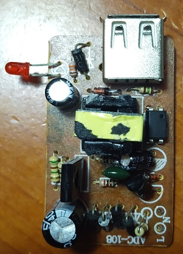
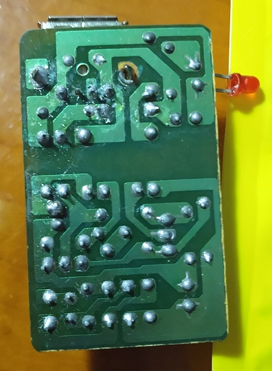
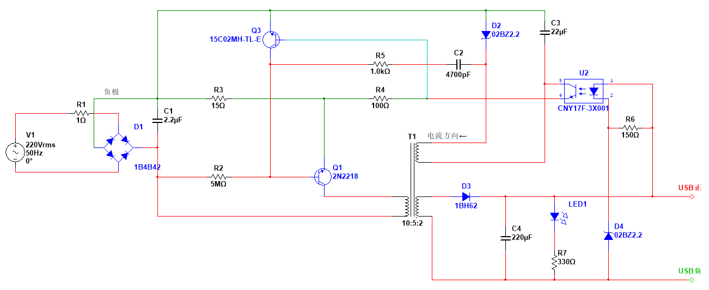

# 山寨手机充电器
> 这个充电器质量比较差，输出电流的功率和直流平滑度都比较低

## 原理分析
1. 220V交流经过整流桥`D1`整流变成脉动直流，经过电容`C1`滤波后变成相对平滑直流。
2. 电阻`R2`为三极管`Q1`提供一个开启电压让电流从变压器`T1`的左边一端流过，让变压器`T1`产生感应电流为右侧两端供电。
3. 变压器`T1`右下一端输出大于0V的正向交流电，经过二极管`D3`确保电流方向，经过电容`C4`滤波后变成相对平滑直流电。`LED1`和电阻`R7`构成充电指示灯。`D4`为5V稳压二极管，当电流大于5V时点亮光耦`U2`，让`U2`的另外一段的电阻值减小，以此来控制三极管`Q3`和`Q1`的导通时间，以此来降低电压。电阻`R6`为光耦分压。
4. 变压器`T1`右上一端构成震荡反馈电路。首先电流给电容`C3`充电，当电压达到一定值时，电流通过光耦`U2`的5、4脚到三极管`Q3`的基极让`Q3`导通，`Q3`导通后则拉低三极管`Q1`的基极电压，使`Q1`处于断路。电容`C3`充电时间的大小决定的交流电的频率，光耦`U2`左边一段的阻值决定了输出电压的高低。
5. 稳压二极管`D2`对电容`C3`起保护作用。电容`C2`电阻`R5`对电容`C3`放电作用。当充电器不工作时，电容`C3`放电，将三极管`Q3`打开，电流经过电容`C2`电阻`R5`回到电容`C3`。
