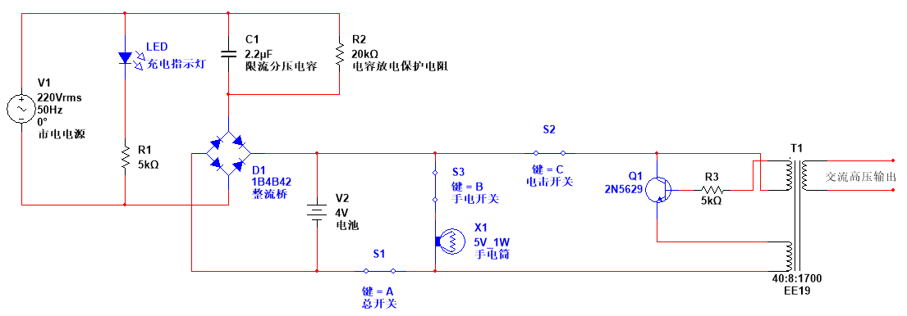

# 电蚊拍充电电路

> [电路模拟文件](./文件/电蚊拍充电电路.ms14)

## 原理分析

这个电路比较简单，其中值得注意的几个地方

1. 该电路没有使用变压器来把 220V 交流电降低，而是使用了一颗电容来完成。根据电容[容抗公式](https://baike.baidu.com/item/%E5%AE%B9%E6%8A%97/1016854?fr=aladdin)，这里的电容相当于一个 1446Ω 的电阻。由于电容属于储能元件，理想情况下电容充放电是不会发热的，所以比从一颗电阻要好。  
   这种电路虽然实现了和变压器同样的功能，但它的功率比较小，每个周期内通过电容的电流大小取决于电容的容量。
2. 三极管`Q1`与变压器构成了一个反激式震荡电路。一开始三极管`Q1`基极有正向电压，`Q1`导通，当变压器产生感应电流后会在左上方那个绕组那形成一个反向电压，相当于串联上了一个反向电池，阻碍了来自电池的电流。因此三极管`Q1`基极电压降低，`Q1`断开。`Q1`断开后变压产生感应电流减小，`Q1`的基极那的反向电压降低，电流又可以从电池到达`Q1`基极，三极管`Q1`又被打开，以此循环往复就形成了交流电。
3. 变压器输出高压双向交流电