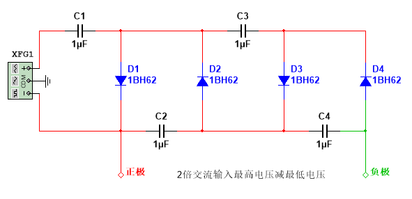
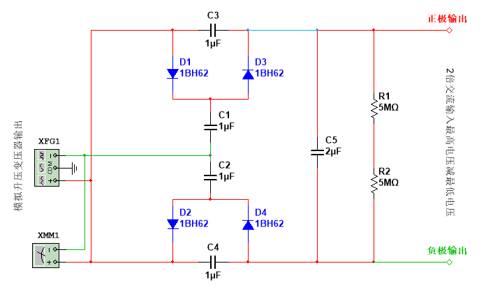
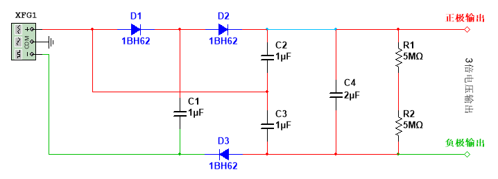

# 电容直流升压电路

我这找了两个不同品牌的电蚊拍，得到了两种电路图。我还找了一种最常被提到的电容升压电路图。

## 常见版

> [电路模拟文件](./文件/常见版电容升压电路.ms14)

这种是最常被提到的，具体是什么原理我这就不细说了，可以[参考视频](https://www.youtube.com/watch?v=DI8Yt1AQrH8)，我这就说说它里面的一些特点。

1. 除了电容`C1`，其他每个电容的电压都等于交流输入最高电压减去交流输入最低电压。
2. 输出端相当于与`C2`、`C4`串联，与`C3`并联，输出电压等于`C2` + `C4`的电压（类似于电池串联）。
3. 电容`C1`的电压等于输入信号正半周期的最高电压。

## 第一种

> [电路背面图](./文件/第一种电路背面.jpg)  
> [电路正面图](./文件/第一种电路正面.jpg)  
> [电路正面图 2](./文件/第一种电路正面2.jpg)  
> [电路模拟文件](./文件/第一种电蚊拍电容升压电路.ms14)

### 原理分析

图中大电容`C5`用作储存电能，电阻`R1`、`R2`是给电容`C5`做放电保护的。

> **条件假设**：
>
> -   为了方便分析电路的升压原理，最好先把`C5`和`R1`、`R2`从图中拿掉（把蓝色的线断开）。
> -   把电源输出的电压波形想象成方波。

1. 当电源电压大于 0V 的时候，先给`C1`、`C2`、`C4`充电，`C1`的电压等于一倍的电源最高正电压。`C2`、`C4`串联，各等于一半的电源最高正电压。
2. 当电源电压小于 0V 的时候，`C1`与电源串联，`C1`释放掉全部的电压给`C3`，`C1`变为 0V，`C3`等于一倍的电源最高负电压。`C2`直接释放掉全部的正电压并充入一倍的电源最高负电压。`C4`由于没有接入电路，电压保持不变。
3. 当电源第二次大于 0V 时，给`C1`充电，让`C1`电压恢复到一倍的电源最高正电压。`C3`由于没有接入电路，电压保持不变。`C2`与电池串联，为了达到平衡，`C2`与电池的反向电压因等于`C4`的正向电压，因此可算出`C2`需释放 3/4 的电压给`C4`。

以此循环往复，最终`C3`、`C4`等于电源交流最高电压减最低电压，`C1`等于电源交流最高电压，`C2`等于电源交流最低电压。`C3`、`C4`串联构成 2 倍交流输入最高电压减最低电压，相当于 4√2 倍的交流电压。

### 设计缺陷

在给`C2`充放电的时候，会造成一些电能浪费。

## 第二种

> [电路模拟文件](./文件/另一种电蚊拍电容升压电路.ms14)

### 原理分析

> **条件假设**：
>
> -   为了方便分析电路的升压原理，最好先把`C4`和`R1`、`R2`从图中拿掉（把蓝色的线断开）。
> -   把电源输出的电压波形想象成方波。

1. 当电源电压大于 0V 时，先给`C1`、`C3`充电，`C2`被导线短路掉了，`C1`、`C3`的电压等于一倍的电源最高正电压。
2. 当电源电压小于 0V 时，`C1`与电源串联，`C1`释放掉全部电压给`C2`，`C1`变为 0V，`C2`等于一倍的电源最高负电压。`C3`断路，电压保持不变。
3. 当电源电压再次大于 0V 时，给`C1`充电，让`C1`的电压恢复到电源最高正电压。由于`C3`的电压已等于电源最高电压，所以不会再有变化。

以此循环往复，最终`C2`等于2倍电源最高负电压，`C3`的电压等于一倍电源最高正电压，`C2`、`C3`串联构成 3√2 倍的交流电压升压。`C1`等于电源最高正电压。
